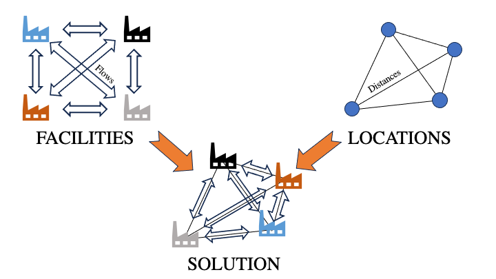

# Quadratic Assignment Problems
Quadratic Assignment Problems, or QAPs, make up a well-known class of NP-hard combinatorial optimization problems which have been described as the "hardest of the hard" [1,2]. They have been applied to factory and hosptial layouts as well as electronic chip design, scheduling, quantum physics and more [1-3]. This example uses D-Wave's Constrained Quadratic Model (CQM) sampler to find solutions for these difficult problems. Due to the extreme difficulty of these problems, even the best-known solutions for many famous QAP are just upper bounds and are not known to be optimal.

Some of the problems on QAPLIB have been solved to optimality, . However, due to the difficulty of QAP in general, many of the best-known solutions on QAPLIB are upper bounds [4]

## Quadratic Assignment Problem Statement
Consider a manufacturing center which needs to have $n$ facilities inside of it. Each facility must be placed in one of $n$ locations. Further, each facility has some material flow between itself and other facilities. Each location must hold one facility and vice-versa. How do we place the facilities to minimize the overall flow and distance between facilities? The goal is to make the system more efficient [1,2].



QAPs are described by zero-diagonal $n\times n$ matrices $A,B$ which represent flow and distance respectively. $A_{jk}$ represents the material flow between facilities $j,k$ while $B_{st}$ represents the distance between locations $s,t$. The problem will also require $n^2$ binary variables $x_{jk}$ which equal $1$ if facility $j$ is in location $k$ and $0$ otherwise [1-3]. Because there are $n^2$ variables, the number of quadratic coefficients in the objective function scales as $O(n^4)$.

The objective is to minimize the flow times distance. Thus the *objective function* $C$ is given by

$$
C=\sum_{j,k,l,m=1}^n f_{jk}d_{lm}x_{jl}x_{km}.
$$

We also must add constraints that restrict solutions to having only one location per facility and vice-versa. We can write these as

$$
\sum_{k=1}^n x_{jk} = 1\text{ } \text{     for all facilities }j
$$

and

$$
\sum_{j=1}^n x_{jk} = 1\text{ } \text{     for all locations }k.
$$

## QAP Size
At first glance there appear to be $2^{n^2}$ potential solutions to a QAP. However, when writing the variables $x_{jk}$ as an $n \times n$ matrix, constraints force any feasible solution to have the form of a permutation matrix. Thus there are only $n!$ feasible solutions. A larger problem instances such as `tho150` has on the order of $10^{262}$ different feasible solutions. To put that into context: if you took the number of atoms in the known universe, cubed it and then multiplied it by ten billion, that number would still be on the order of one *trillion* times smaller than the number of *feasible* solutions for `tho150` [5]. The number of total possible solutions is significantly higher than even that.

## Usage

To run the code, type the following into the command terminal:

```bash
python qap_cqm.py 
```

* The default command uses the `tai12a` problem. To run a different problem, e.g. `sko72`, you can use the option `--filename sko72`. These problems' labels are all found in the `QAP_problems` folder. The integer in each label represents the dimensionality of matrices $A,B$ and thus is the square-root of the number of binary variables in the problem.

* Using the option `--not_verbose` will prevent the code from printing status updates and the final results in the command terminal.

* Using the option `--pre_solve False` will turn off D-Wave's Presolve methods which make the problem more amenable to the CQM hybrid sampler.

* Using the option `--runtime` will allow you to manually set the problem runtime on the CQM sampler. If you choose a value that is too low the code will automatically adjust to the estimated minimum runtime.

As an example, if you want to run problem `tho30` for 20s *without* applying D-Wave's presolve methods or printing statements, you would enter the following into the command line:

```bash
python qap_cqm.py --filename tho30 --not_verbose --pre_solve False --runtime 20
```

## Code Overview
This code constructs a CQM object out of a previously-established QAP benchmark from QAPLIB. It then solves the problem and compares the results to the best known solution.

### Main Functions
* `read_problem_dat()` reads the QAPLIB problem file stored in a `.dat` format and converts it to matrices $A,B$
* `read_solution()` reads the QAPLIB problem solution file stored in a `.sln` format and extracts the best-known value for the QAP's objective function
    * The best-known solution is not necessarily optimal, though for some cases it is (e.g. `tai12a`, `had20` and `rou20` [4])
* `set_qap_objective()` converts matrices $A,B$ into the objective function for the QAP and writes it into a CQM object
* `add_1_hot()` writes one of the constraints into the CQM object.
* `add_discrete()` calls `add_1_hot()` and forces the CQM object to recognize it as a one-hot (i.e "discrete") constraint
* `build_cqm()` calls on the functions in the previous 5 bullet points to construct the CQM object representing the original Quadratic Assignment Problem.
* `main()` calls `build_cqm()` and uses D-Wave's hybrid Constrained Quadratic Model sampler to solve the QAP. It then finds the relative error between the sampled objective value and the best-known value from QAPLIB. This function also controls all the command line option functionality.

### Side Functions
* `relative_error_percent()` returns the relative error between observed and expected values as a percent with 2 decimal places of precision
* `round_decimals_up()` rounds floats *up* to a certain decimal place

## Code Specifics

* In addition to solve time, runtime for this code includes reading the problem data, constructing the problem object and filtering for feasible solutions
    * Writing the CQM object's constraints and filtering for feasible solutions take the most time as problem size increases
    * The simplest problems take on the order of seconds while `tai256c` took almost 2.5 hours
    * This code automatically scales the runtime to problem size
    * The CQM sampler has a minimum runtime of 5s
* D-Wave's hybrid solvers treat the quadratic nature of the problem natively instead of linearizing the problem

## Preliminary Results
These are some early results from running a selection of QAPs on a 2022 Macbook Air. For all cases we set `pre_solve = True` to apply D-Wave's problem treatment tools before solving.

| Problem | # Coefficients | Formulation Time (s) | Solve Time (s) | Feasibility Time (s) | Total Time (s) | Solved Energy | Best Known Energy | Relative Error |
|:---:|:---:|:---:|:---:|:---:|:---:|:---:|:---:|:---:|
|tai12a | $8.9\times 10^3$ | 0.0 | 5.0 | 6.9 | 11.9 | 224416 | 224416 | 0% |
|tai12b | $7.5\times 10^3$ | 0.0 | 5.0 | 6.8 | 11.8 | 39464925 | 39464925 | 0% |
|tai20a | $7.1\times 10^4$ | 0.3 | 5.0 | 6.4 | 11.7 | 708018 | 703482 | 0.64% |
|rou20 | $7.2\times 10^4$ | 1.0 | 5.0 | 8.2 | 14.2 | 725522 | 725522 | 0% |
|tai150b | $1.7\times 10^8$ | 918.6 | 814.7 | 3733.9 | 5467.2 | 499623949 | 498896643 | 0.14% |
|tho150 | $1.1\times 10^8$ | 857.7 | 496.5 | 988.6 | 2342.8 | 8197622 | 8133398 | 0.79% |
|tai256c | $2.8\times 10^8$ | 709.2 | 1299.0 | 6470.1 | 8478.3 | 44932538 | 44759294 | 0.39% |

In general our hybrid offerings tend to give good results in reasonable time instead of perfect results after long calculations.

## References
1. S. Sahni & T. Gonzalez, "P-Complete Approximation Problems," 1976, [University of Minnesota](https://dl.acm.org/doi/pdf/10.1145/321958.321975)
2. C.W. Commander, "A Survey of the Quadratic Assignment Problem, with Applications," 2003, [University of Florida](http://plaza.ufl.edu/clayton8/article.pdf)
3. M. Dall'Arno, F. Buscemi & T. Koshiba, "Computing the Quantum Guesswork, a Quadratic Assignment Problem," 2023, [Nagoya University](https://www.rintonpress.com/xxqic23/qic-23-910/0721-0732.pdf)
4. Computational Optimization Research at Lehigh (COR@L), [QAPLIB](https://coral.ise.lehigh.edu/data-sets/qaplib/qaplib-problem-instances-and-solutions/)
5. John C. Villanueva, "How Many Atoms Are There in the Universe?" 2009, [Universe Today](https://www.universetoday.com/36302/atoms-in-the-universe/amp/)


## License

Released under the Apache License 2.0. See [LICENSE](LICENSE) file.
