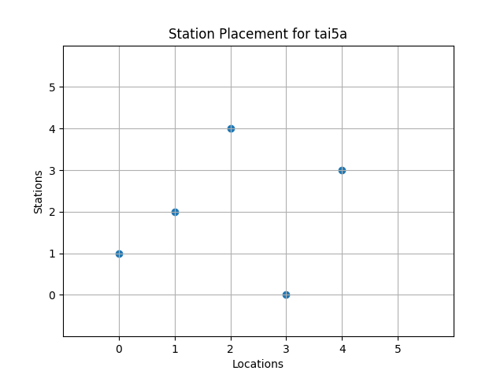
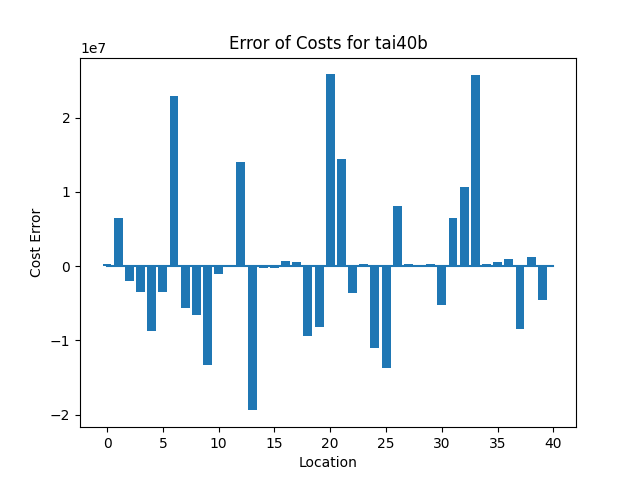

# Quadratic Assignment Problems
Quadratic Assignment Problems, or QAPs, make up a well-known class of NP-hard combinatorial optimization problems which have been described as the "hardest of the hard" [1,2]. They have been applied to factory and hospital layouts as well as electronic chip design, scheduling, quantum physics and more [1-3]. 

[QAPLIB](https://coral.ise.lehigh.edu/data-sets/qaplib/qaplib-problem-instances-and-solutions/) is a public library containing well-studied QAPs for benchmarking purposes. Some of the problems on QAPLIB have been solved to optimality but due to the difficulty of QAPs in general, many of the best known solutions on QAPLIB are upper bounds [4]. This example uses D-Wave's hybrid Constrained Quadratic Model (CQM) sampler to find solutions for these difficult problems. 

## Quadratic Assignment Problem Statement
Consider a manufacturing center which needs to have $n$ stations inside of it. Each station must be placed in one of $n$ locations. Further, each station has some material flow between itself and other station. Each location must hold one station and vice-versa. How do we place the stations to minimize the overall flow and distance between stations? The goal is to make the system more efficient [1,2]. The stations can also be thought of as factories which need to be built in various locations.


QAPs are described by zero-diagonal $n\times n$ matrices $A,B$ which represent flow and distance respectively. $A_{jk}$ represents the material flow between stations $j,k$ while $B_{st}$ represents the distance between locations $s,t$. The problem will also require $n^2$ binary variables $x_{jk}$ which equal $1$ if station $j$ is in location $k$ and $0$ otherwise [1-3].

The objective is to minimize the flow times distance. Thus the *objective function* $C$, the equation we are trying to minimize, is given by

$$
C=\sum_{j,k,l,m=1}^n f_{jk}d_{lm}x_{jl}x_{km}.
$$

We also must add constraints that restrict solutions to having only one station per location and vice-versa. We can write these as

$$
\sum_{k=1}^n x_{jk} = 1\text{ } \text{     for all stations }j
$$

and

$$
\sum_{j=1}^n x_{jk} = 1\text{ } \text{     for all locations }k.
$$

## QAP Size
$A,B$'s diagonal entries are zero so there will be no linear terms in the objective function. The number of quadratic terms scales as $O(n^4)$ to a maximum of $n^2\left(n^2+1\right)/2$. This means that solving methods which linearize problems will struggle as the number of quadratic terms in the objective function can increase rapidly with $n$.

At first glance there appear to be $2^{n^2}$ potential solutions to a QAP; one for every possible sequence of $n^2$ zeroes or ones. However, when writing the variables $x_{jk}$ as an $n \times n$ matrix, constraints force any feasible solution to have the form of a permutation matrix. Thus there are only $n!$ feasible solutions. To put that into context: a larger problem instances such as `tho150` has on the order of $10^{262}$ different feasible solutions. If you took the number of atoms in the known universe, cubed it and then multiplied it by ten billion, that number would still be on the order of one *trillion* times smaller than the number of feasible solutions for `tho150` [5]. The number of total possible solutions is significantly higher than even that and `tho150` is not even the largest problem included in this example.

## Usage

To run the default code, type the following into the command terminal:

```bash
python qap_cqm.py 
```

* The default command uses the `tai12a` problem instance. To run a different problem, e.g. `tho30`, you can use the option `--filename tho30`. These problems' labels are all found in the `QAP_problems` folder. The integer in each label represents the number of stations or locations, $n$, and is the dimensionality of the square $A,B$ matrices.

* Using the option `--verbose False` will prevent the code from printing status updates and the final results in the command terminal.

* Using the option `--pre_solve False` will turn off D-Wave's presolve methods which make the problem more amenable to the CQM hybrid sampler.

* Using the option `--runtime` will allow you to manually set the problem runtime on the CQM sampler. If you choose a value that is too low the code will automatically adjust to the estimated minimum runtime. The miminum value is 5s.

* Using the option `--plot False` will stop the `main()` function from plotting the results

As an example: if you wanted to run problem `tho30` for 20s without applying D-Wave's presolve methods, printing statements or plotting the results you would enter the following into the command line:

```bash
python qap_cqm.py --filename tho30 --verbose False --pre_solve False --runtime 20 --plot False
```

## Code Overview
This code constructs a CQM object out of a previously-established QAP benchmark from QAPLIB. It then solves the problem and compares the results to the best known solution.

### Main Functions
* `read_problem_dat()` reads the QAPLIB problem file stored in a `.dat` format and converts it to matrices $A,B$. These matrices represent the flow and distance matrices of the original QAP formulation
* `read_solution()` reads the QAPLIB problem solution file stored in a `.sln` format and extracts the best known value for the QAP's objective function
    * The best known solution is not necessarily optimal, though for some cases it is (e.g. `tai12a`, `had20` and `rou20` [4])
* `set_qap_objective()` converts matrices $A,B$ into the objective function for the QAP and writes it into a CQM object
* `add_1_hot()` writes one of the constraints into the CQM object
* `add_discrete()` calls `add_1_hot()` and forces the CQM object to recognize it as a one-hot (i.e "discrete") constraint
* `build_cqm()` calls on the functions in the previous 5 bullet points to construct the CQM object representing the original Quadratic Assignment Problem
* `main()` calls `build_cqm()` and uses D-Wave's hybrid Constrained Quadratic Model sampler to solve the QAP. It then finds the relative error between the sampled objective value and the best known value from QAPLIB. This function also controls all the command line option functionality.

### Side Functions
* `solution_plotter()` plots the solution obtained by the hybrid solver as a grid showing which stations are in which locations
* `relative_error_percent()` returns the relative error between observed and expected values as a percent with 2 decimal places of precision
* `round_decimals_up()` rounds floats up to a certain decimal place

### Output Plot


If the `plot` option is not set to `False`, then the code will construct a plot of the solution. Each point on the plot represents a station placed at a location. For example: the plot above has a point at (1,2) indicating that station 2 is placed at location 1.



Alternatively, we can view solution as a histogram of cost (flow times distance) for each location in the solution. To compare to the best-known solution from QAPLIB we'll plot the cost difference between the CQM and best known solutions for each location. If the bar is negative then it corresponds to a location being less costly and if the bar is positive then the opposite is true.

## Code Specifics

* In addition to solve time, runtime for this code includes reading the problem data, constructing the problem object and filtering for feasible solutions
    * CQM runtime is the most time-intensive part of the code as $n$ increases
    * The simplest problems take on the order of seconds while `tai256c` took almost 2.5 hours
    * The `--runtime` option only controls the maximum possible runtime for the hybrid CQM sampler
* D-Wave's hybrid samplers treat the quadratic nature of the problem natively instead of linearizing the problem
* QAPs can be defined with non-square $A,B$ matrices but we assume they are square for clarity of this example


## Preliminary Results
These are some early results from running a selection of QAPs through D-Wave's Leap™ cloud service and Advantage™ quantum annealer. For all cases we set `pre_solve = True` to apply D-Wave's problem treatment tools before solving. Relative Error corresponds to the difference between the solution found by `LeapHybridCQMSampler` and the best known value on QAPLIB.


| Problem | # Coefficients | Formulation Time (s) | Solve + Feasibility Time (s) | Total Time (s) | Solved Cost | Best Known Cost | Relative Error |
|:---:|:---:|:---:|:---:|:---:|:---:|:---:|:---:|
|tai12a | $8.9\times 10^3$ | 0.0 | 11.9 | 11.9 | 224416 | 224416 | 0% |
|tai12b | $7.5\times 10^3$ | 0.0 | 11.8 | 11.8 | 39464925 | 39464925 | 0% |
|tai20a | $7.1\times 10^4$ | 0.3 | 11.4 | 11.7 | 708018 | 703482 | 0.64% |
|rou20 | $7.2\times 10^4$ | 1.0 | 13.2 | 14.2 | 725522 | 725522 | 0% |
|tai50b | $2.1\times 10^6$ | 6.5 | 24.9 | 31.4 | 460032387 | 458821517 | 0.26% |
|tai80a | $2.0\times 10^7$ | 86.1 | 350.1 | 436.2 | 13682464 | 13499184 | 1.36% |
|tai100a | $4.8\times 10^7$ | 207.5 | 583.6 | 791.1 | 21332192 | 21052466 | 1.33% |
|tai150b | $1.7\times 10^8$ | 918.6 | 4548.6 | 5467.2 | 499623949 | 498896643 | 0.14% |
|tho150 | $1.1\times 10^8$ | 857.7 | 1485.1 | 2342.8 | 8197622 | 8133398 | 0.79% |
|tai256c | $2.8\times 10^8$ | 709.2 | 7769.1 | 8478.3 | 44932538 | 44759294 | 0.39% |

In the above table, the solver runtime is combined with the time required to filter for feasible solutions, where in general the filtering time is negligible compared to solve time.

The [QAPLIB website](https://coral.ise.lehigh.edu/data-sets/qaplib/qaplib-problem-instances-and-solutions/) does not list runtimes to obtain the best known solutions so they were not available to compare with [4]. 

## References
1. S. Sahni & T. Gonzalez, "P-Complete Approximation Problems," 1976, [University of Minnesota](https://dl.acm.org/doi/pdf/10.1145/321958.321975)
2. C.W. Commander, "A Survey of the Quadratic Assignment Problem, with Applications," 2003, [University of Florida](http://plaza.ufl.edu/clayton8/article.pdf)
3. M. Dall'Arno, F. Buscemi & T. Koshiba, "Computing the Quantum Guesswork, a Quadratic Assignment Problem," 2023, [Nagoya University](https://www.rintonpress.com/xxqic23/qic-23-910/0721-0732.pdf)
4. Computational Optimization Research at Lehigh (COR@L), [QAPLIB](https://coral.ise.lehigh.edu/data-sets/qaplib/qaplib-problem-instances-and-solutions/)
5. John C. Villanueva, "How Many Atoms Are There in the Universe?" 2009, [Universe Today](https://www.universetoday.com/36302/atoms-in-the-universe/amp/)


## License

Released under the Apache License 2.0. See [LICENSE](LICENSE) file.
